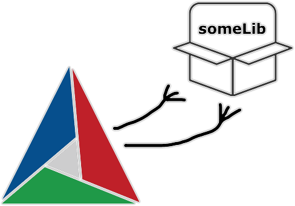

# GUI with Dear ImGUI framework

GUI app example in C++ and Dear ImGui Framework

- Using App-Core architecture
- ImGUI forked and add CMakeLists.txt for integration
- Graphics backend implement OpenGL + SDL3 (GLFW to be implemented)
- PostgreSQL database
- Modbus TCP/IP connection (to be implemented)
- CAN-BUS connection (to be implemented)
- Remote access via OpenVPN (to be implemented)

## Targets

- Linux Host
- BeagleBone Play (AARCH64)
- Raspberry Pi4 (AARCH64) (to be implemented)

# Libraries

## Dear IMGui

[Link] https://github.com/ocornut/imgui.git

[Link] https://decovar.dev/blog/2021/03/08/cmake-cpp-library/

[Link] https://github.com/danielbrupaiva/imgui.git

## SDL3

[Link] https://github.com/libsdl-org/SDL.git

    $ cd SDL
    $ git checkout dad1a84be4e9236267dd7c5393b56c60b3ed7875
    $ sudo su
    $ cmake -S . -B build && cmake --build build && cmake --install build

## SDL3_image

[Link] https://github.com/libsdl-org/SDL_image.git

    $ git clone https://github.com/libsdl-org/SDL_image.git
    $ cd SDL_image
    $ git checkout 77441588fa084269d4fe99ba21e2690853245764
    $ sudo su
    $ cmake -S . -B build && cmake --build build && cmake --install build

## GLFW (optional)

[Link] https://github.com/glfw/glfw.git

    $ sudo apt install libglfw3-dev

## Build

    $ mkdir build && cd build
    $ cmake -GNinja -DCROSS_COMPILER=ON -DCMAKE_TOOLCHAIN_FILE=../cmake/toolchain.cmake ..
    $ ninja
